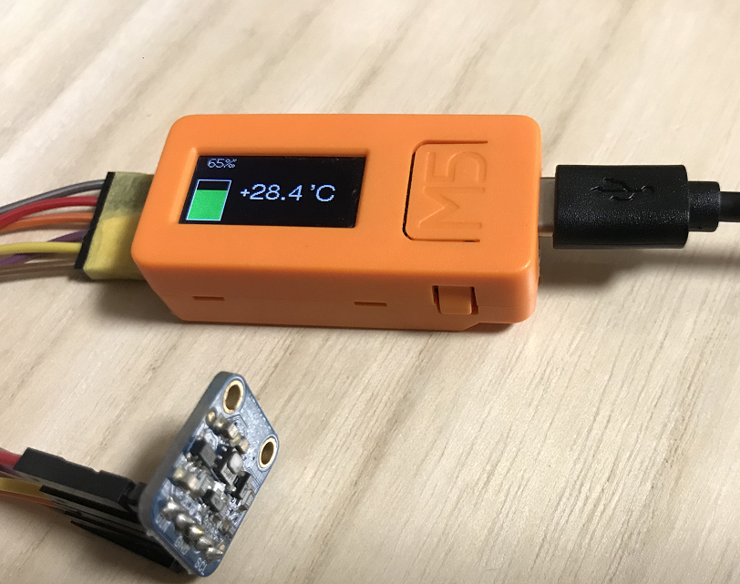

# Arduino-M5StickC-HTU21DF
Temperature & Humiditiy Monitoring Application for M5Stick(Arduino)

## Overview

  

## Requirement

- [M5Stick-C(ESP32)](https://www.switch-science.com/catalog/6350/)
- [HTU21D-F](https://www.switch-science.com/catalog/1799/)
- Arduino IDE (Version: 1.8.5)

## Description

###  Pin connections

|M5Stick-C  |HTU21D-F  |Note  |
|---|---|---|
|GND  |GND  ||
|5V->  | VIN ||
|G0  | SDA ||
|G26  | SCL ||
